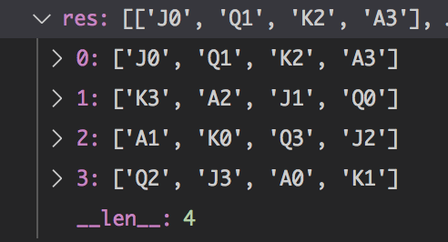

## Question

- Put these 16 cards in a `4*4` board. Make sure each row, each column, and each main diagonal don't have conflict.
- Conflict means same number or same suit.
- Thest cards are: J♥️, J♦️, J♠️, J♣️, Q♥️, Q♦️, Q♠️, Q♣️, K♥️, K♦️, K♠️, K♣️, A♥️, A♦️, A♠️, A♣️.

## Solution Idea

- Backtracking, calculate all posible solutions. And if one step conflicted, then drop the whole board. (previous recursion will continue to calculate)

## Result Screenshot

